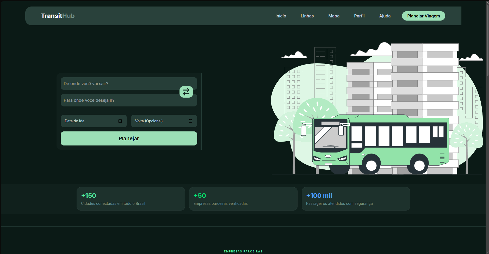
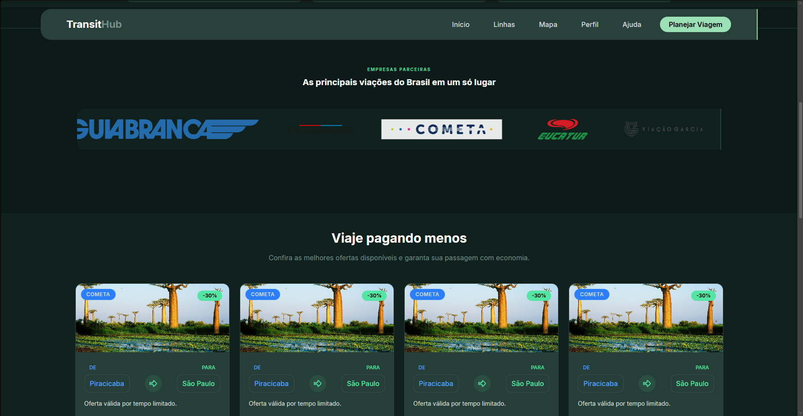
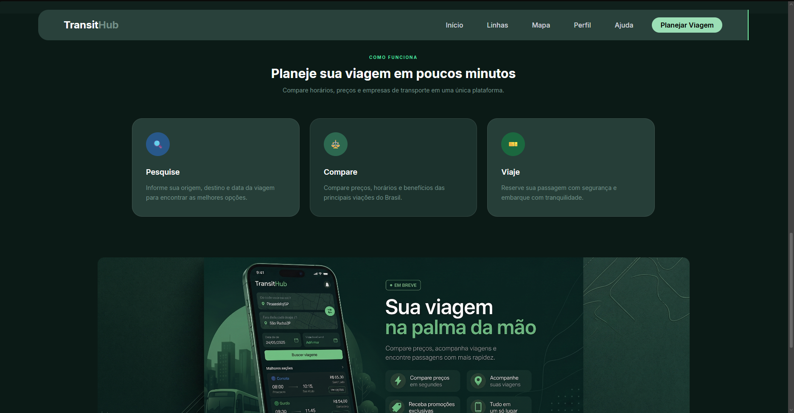

# TransitHub 🚍

TransitHub é uma plataforma moderna de busca e comparação de passagens rodoviárias desenvolvida com React e Tailwind CSS.

O projeto foi criado com o objetivo de praticar desenvolvimento front-end através da construção de uma aplicação com aparência profissional, focada em experiência do usuário, design moderno e componentes reutilizáveis.

---

## ✨ Sobre o Projeto

O TransitHub permite que os usuários encontrem opções de viagem de forma rápida e intuitiva.

Atualmente a plataforma conta com:

- Busca de viagens por origem, destino e data
- Interface moderna e totalmente responsiva
- Seção de promoções e ofertas especiais
- Empresas parceiras em destaque
- Banner promocional para aplicativo mobile
- Experiência visual inspirada em plataformas reais do mercado
- Componentes reutilizáveis desenvolvidos em React

O projeto continua evoluindo com novas funcionalidades e melhorias visuais.

---

## 🛠️ Tecnologias Utilizadas

- React
- Tailwind CSS
- JavaScript (ES6+)
- Vite
- Lucide React

---

## 🎯 Objetivos de Aprendizado

Este projeto faz parte da minha jornada como desenvolvedor front-end e tem como foco:

- Componentização com React
- Gerenciamento de estados
- Criação de interfaces modernas
- Responsividade para diferentes dispositivos
- Organização profissional de projetos
- Boas práticas de desenvolvimento
- Construção de portfólio com projetos reais

---

## 🚀 Funcionalidades Implementadas

✔️ Header responsivo

✔️ Hero Section

✔️ Sistema de pesquisa de viagens

✔️ Estatísticas da plataforma

✔️ Empresas parceiras

✔️ Seção de promoções

✔️ Banner do aplicativo mobile

✔️ Layout moderno com identidade visual própria

🔄 Melhorias contínuas de UI/UX

---

## 🚧 Próximas Implementações

- Página de resultados de busca
- Integração com APIs
- Favoritos
- Sistema de autenticação
- Tema claro/escuro
- Dashboard do usuário
- Histórico de viagens
- Aplicação completa em React

---

## 📷 Preview

### Hero Section

### Parceiros e Ofertas

### Banner App + Como Funciona

--

## 📌 Autor

João Paulo

Estudante de Análise e Desenvolvimento de Sistemas (ADS)

Desenvolvedor Front-End em constante evolução

Tecnologias: HTML • CSS • JavaScript • React • Tailwind CSS • Git/GitHub

---

⭐ Projeto desenvolvido para aprendizado, prática e construção de portfólio.
